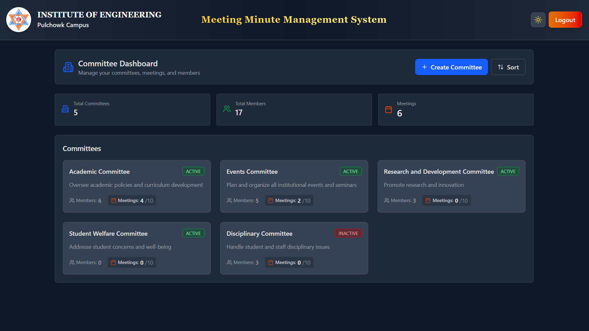
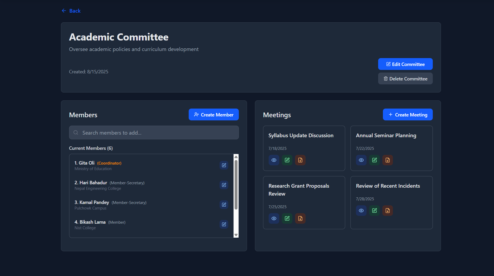
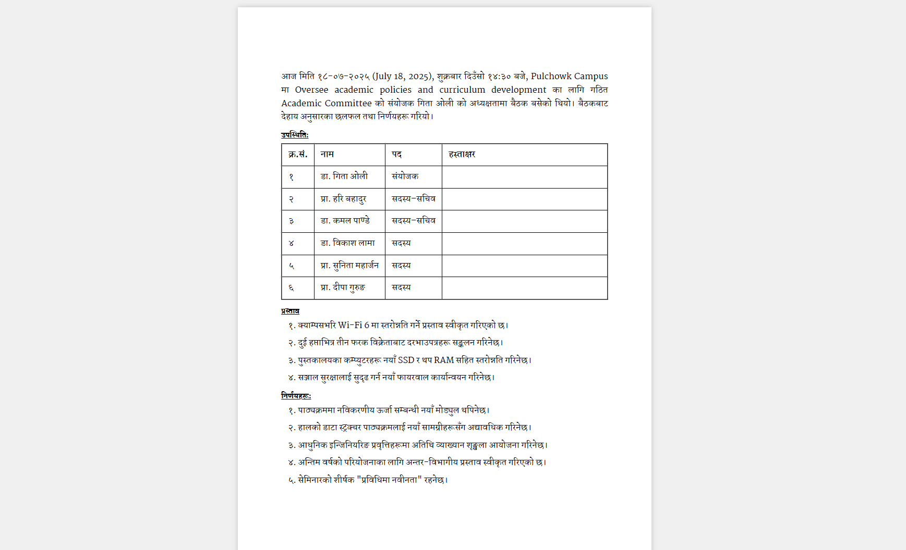
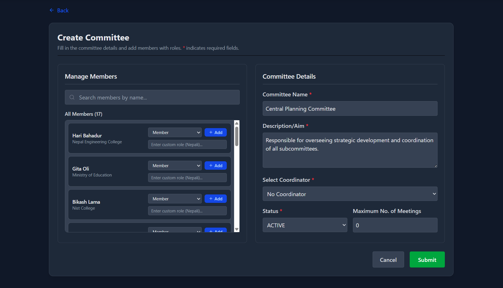
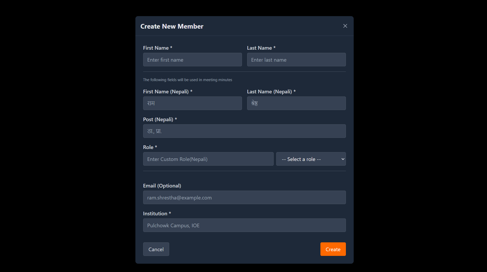
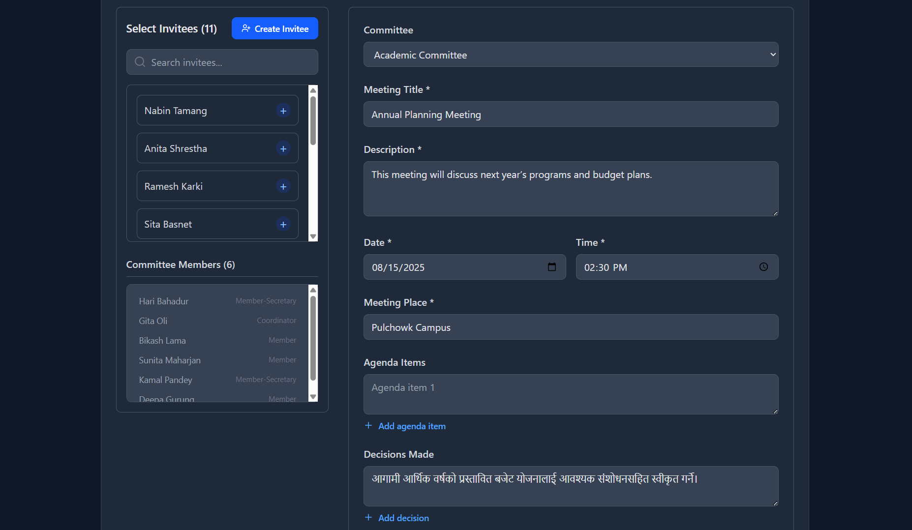
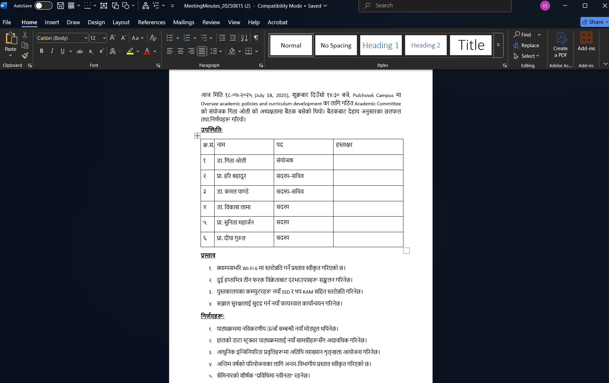

# Backend for Meeting Minute Management System

**Institution of Engineering, Pulchowk Campus**

> **NOTE:** The frontend for this system was developed by a team of four and is available at [meeting-minute-management-system](https://github.com/GauravDahal18/meeting-minute-management-system?tab=readme-ov-file)

## Problem Statement

This project addresses the following institutional challenges:

1. **Committee Management** - Track active committees from a centralized dashboard

   

2. **Meeting History** - Maintain records of previously created meeting minutes

   

3. **Document Generation** - Create standardized meeting minutes using templates

   

## System Workflow

1. **Committee Creation** - Admin establishes committees in the system that mirror real institutional committees

   

2. **Member Management** - Admin creates member profiles for all committee participants or reuses existing profiles

   

3. **Meeting Documentation** - Admin creates meetings, records agendas, and documents decisions

   

4. **Document Export** - Admin previews and downloads meeting minutes as Word documents for final formatting

   

## Additional Features

-  Update committee, member, and meeting details after creation
-  Create meeting invitees through new or existing member profiles
-  Same member profile can be used in multiple committees

> **NOTE:** The frontend supports both dark mode and light mode for enhanced user experience

> **NOTE:** The actual minute creation is done by using thymeleaf and word file creation is done by using Apache POI

## Technology Stack

**Frontend:**

-  React
-  Tailwind CSS

**Backend:**

-  Spring Boot
-  Spring Data JPA with custom queries for complex database operations
-  Spring Security
