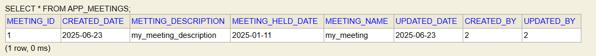
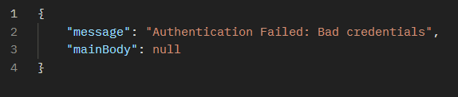
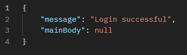
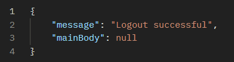
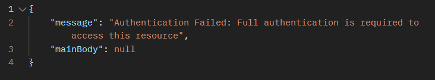
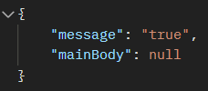
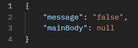
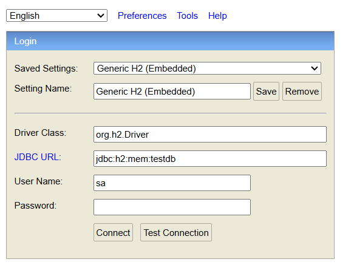
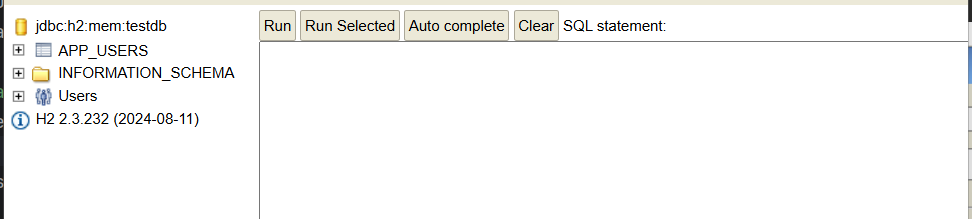

# All the routes till now: 


| REQUEST URL                                          | Description                                                                                                                                                                                                                                                                                                                                 |
| ---------------------------------------------------- | ------------------------------------------------------------------------------------------------------------------------------------------------------------------------------------------------------------------------------------------------------------------------------------------------------------------------------------------- |
| /api/getMemberDetails?memberId=1                     | gets the details about the specified user                                                                                                                                                                                                                                                                                                   |
| /api/addMembersToCommittee?committeeId=2             | adds the specified member to the committee<br><br>request format: <br><br>[<br>    {<br>        "member":{<br>           "id":1<br>        },<br>        "role":"New Role"<br>    }<br>]                                                                                                                                                    |
| /api/getMeetingDetails?committeeId=1&meetingId=1<br> | returns the details of the meeting                                                                                                                                                                                                                                                                                                          |
| /api/addAttendeesToMeeting?committeeId=1&meetingId=1 | adds the attendees mentioned in the request body <br><br>Request body should be of the format:<br><br>[5, 6]<br>                                                                                                                                                                                                                            |
| /api/committee/createMeeting?committeeId=1           | creates a meeting for a particular committee                                                                                                                                                                                                                                                                                                |
| /api/createMember?committeeId=1                      | creates a member for a particular committee                                                                                                                                                                                                                                                                                                 |
| /api/getCommitteeDetails?committeeId=1               | returns the details of the committee                                                                                                                                                                                                                                                                                                        |
| /api/createCommittee                                 | creates a new committee                                                                                                                                                                                                                                                                                                                     |
| /api/searchMembersByName?name=Sita Tha               | If the name is a single keyword, all the entites that have the keyword as a substring in firstname or last name is returned.<br><br> If the name is a white space separate values, the first two strings are treated as two separate keyword and all the entites that have the keyword as a substring in firstname or last name is returned |
| /getCommittees                                       | returns the committees for the user                                                                                                                                                                                                                                                                                                         |
| /register                                            | registers new user                                                                                                                                                                                                                                                                                                                          |
| /login                                               |                                                                                                                                                                                                                                                                                                                                             |
| /logout                                              |                                                                                                                                                                                                                                                                                                                                             |
| /isAuthenticated                                     |                                                                                                                                                                                                                                                                                                                                             |


# Latest Changes: 

## 1. Implemented /getMemberDetails(GET)


- Fetches the member details of the member specified in the query paramter
- For the request to be successful: 

	i. The member should exist in the database
	ii. The member should be accessible to the current user(ie the current user must have created that member)


`request: /api/getMemberDetails?memberId=1`

`response body:  `
``` json 
{
    "message": null,
    "mainBody": {
        "memberId": 1,
        "firstName": "Hari",
        "lastName": "Bahadur",
        "institution": "Nepal Engineering College",
        "post": "Assistant Professor",
        "qualification": "MSc IT",
        "committeeWithMeetings": [
            {
                "committeeInfo": {
                    "id": 2,
                    "committeeName": "Events Committee",
                    "committeeDescription": "Plans and organizes all institutional events and seminars.",
                    "role": "New Role"
                },
                "meetingInfos": [
                    {
                        "id": 6,
                        "meetingName": "Campus Wi-Fi Upgrade Plan",
                        "meetingDescription": "Finalizing the plan to upgrade network infrastructure.",
                        "hasAttendedMeeting": false
                    },
                    {
                        "id": 5,
                        "meetingName": "Canteen and Hostel Feedback Session",
                        "meetingDescription": "Discussing feedback from students on facilities.",
                        "hasAttendedMeeting": false
                    }
                ]
            },

            {
                "committeeInfo": {
                    "id": 1,
                    "committeeName": "Academic Committee",
                    "committeeDescription": "Oversees academic policies and curriculum development.",
                    "role": "Chairperson"
                },

                "meetingInfos": [
                    {
                        "id": 1,
                        "meetingName": "Syllabus Update Discussion",
                        "meetingDescription": "Discussing proposed updates to the engineering syllabus.",
                        "hasAttendedMeeting": true
                    },
					
                    {
                        "id": 2,
                        "meetingName": "Annual Seminar Planning",
                        "meetingDescription": "Organizing the annual institutional seminar.",
                        "hasAttendedMeeting": true
                    },
                    {
                        "id": 3,
                        "meetingName": "Research Grant Proposals Review",
                        "meetingDescription": "Assessment of new research funding requests.",
                        "hasAttendedMeeting": true
                    },

                    {
                        "id": 4,
                        "meetingName": "Review of Recent Incidents",
                        "meetingDescription": "Addressing recent disciplinary cases and policy updates.",
                        "hasAttendedMeeting": true
                    }
                ]
            }
        ]
    }
```


## 2. Implemented /addMembersToCommittee(POST)

- adds the specified members in the request body to the committee

	i. The member's role must also be specified, else it will return validation error
	ii. The committee should exist and be accessible by the request sender
	iii. The meeting should exist and be be accessible by the request sender
	iv. The members to be added must exist and be accessible by the request sender

`/api/addMembersToCommittee?committeeId=2`

`request body: `

``` json
[
    {
        "member":{
            "id":9
        },
        "role":"New Role"
    },
        {
        "member":{
            "id":10
        },
        "role":"New Role"
    }
]
```

`response body:`

``` json
{
    "message": "New member added to the committee successfully",
    "mainBody": [
        {
            "id": 9,
            "firstName": "Ramesh",
            "lastName": "Karki",
            "institution": "Nepal Telecom",
            "post": "IT Officer",
            "qualification": "BSc CSIT",
            "email": "ramesh.karki@example.com",
            "createdDate": [
                2025,
                7,
                16
            ]
        },
        {
            "id": 10,
            "firstName": "Sita",
            "lastName": "Basnet",
            "institution": "Kathmandu University",
            "post": "Research Fellow",
            "qualification": "PhD Biotechnology",
            "email": "sita.basnet@example.com",
            "createdDate": [
                2025,
                7,
                17
            ]
        }
    ]
}
```


# Previous Changes

# 1. Implemented /getMeetingDetails (GET)

- It accepts the committee id and meeting id and returns the meeting details in the response body

## Exmaple
`/api/getMeetingDetails?committeeId=1&meetingId=1`

## Response

```json
	{
    "message": null,
    "mainBody": {
        "id": 1,
        "title": "Syllabus Update Discussion",
        "description": "Discussing proposed updates to the engineering syllabus.",
        "heldDate": [
            2025,
            7,
            18
        ],
        "heldTime": [
            14,
            30
        ],
        "heldPlace": "Pulchowk Campus",
        "createdDate": [
            2025,
            7,
            13
        ],
        "updatedDate": [
            2025,
            7,
            13
        ],
        "attendees": [
            {
                "memberId": 1,
                "firstName": "Hari",
                "lastName": "Bahadur",
                "membership": {
                    "role": "Chairperson"
                }
            }
        ],
        "decision": [
            {
                "decisionId": 1,
                "decision": "New module on Renewable Energy to be added to the curriculum."
            },
            {
                "decisionId": 2,
                "decision": "The existing Data Structures course is to be updated with new materials."
            },
        ],
        "coordinator": {
            "memberId": 1,
            "firstName": "Hari",
            "lastName": "Bahadur",
            "membership": {
                "role": "Chairperson"
            }
        }
    }
}
```


# Previous Changes: 

# 1. Implemented /addAttendeesToMeeting(Post)

- it accepts the comitteeId and meetingId of the meeting to which the attendees are to be added in the query parameters 

- It accepts the list of ids of the attendee in the request body

## Example: 

`/api/addAttendeesToMeeting?committeeId=1&meetingId=1`

## Request Body

``` json
[5, 6]
```

## Response Body

``` json
{
    "message": null,
    "mainBody": [
        {
            "id": 5,
            "firstName": "Kamal",
            "lastName": "Pandey",
            "institution": "Pulchowk Campus",
            "post": "Associate Professor",
            "qualification": "PhD Civil Engineering",
            "email": "kamal.pandey@example.com",
            "createdDate": [
                2025,
                7,
                12
            ]
        },
        {
            "id": 6,
            "firstName": "Deepa",
            "lastName": "Gurung",
            "institution": "Patan College for Professional Studies",
            "post": "HR Manager",
            "qualification": "MBS",
            "email": "deepa.gurung@example.com",
            "createdDate": [
                2025,
                7,
                13
            ]
        }
    ]
}
```


# Previous Changes: 

Some field names have been changed: 


| Old                     | New         |
| ----------------------- | ----------- |
| 1. committeeName        | name        |
| 2. committeeDescription | description |
| 3. committeeId          | id          |
| 4. meetingId            | id          |
| 5. meetingTitle         | title       |
| 6. meetingDescription   | description |
| 7. meetingHeldDate      | heldDate    |
| 8. meetingHeldTime      | heldTime    |
| 9. meetingHeldPlace     | heldPlace   |
| 10. memberId            | id          |


# Previous Changes

# [1] Implements /api/committee/createMeeting (POST)

- /committee/createMeeting creates a meeting for a particular committee
- to specify which committee, the committeeId must be provided as a query parameter as follows: 

	`/api/committee/createMeeting?committeeId=1`

- Following fields are mandatory: 
	i. meetingTitle
	ii. meetingHeldDate
	iii. meetingHeldTime
	iv. meetingHeldPlace


`NOTE: this route returns the saved meeting in the response body`
## Examples

## 1. Valid Request

### Request Body

```json
	{
      "meetingTitle": "Meeting to discuss budget",
      "meetingDescription": "This meeting discussed the finances for the next fiscal year",
      "meetingHeldDate": "2025-07-09",
      "meetingHeldPlace": "Kathmandu, Nepal",
      "meetingHeldTime": "14:30:00",
      "coordinator": {
        "memberId":2
      },
	  "attendees": [
        {
          "memberId": 1
        }
      ],
      "decisions": [
        {
          "decision": "Approved annual budget."
        },
        {
          "decision": "Scheduled next meeting for August."
        }
      ]
    }
```


`HTTP OK`

``` json
{
    "message": null,
    "mainBody": {
        "meetingId": 2,
        "meetingTitle": "Meeting to discuss budget",
        "meetingDescription": "This meeting discussed the finances for the next fiscal year",
        "meetingHeldDate": [
            2025,
            7,
            9
        ],
        "meetingHeldTime": [
            14,
            30
        ],
        "meetingHeldPlace": "Kathmandu, Nepal",
        "createdDate": [
            2025,
            7,
            9
        ]
    }
}
```


### 2. Mandatory Fields Are Missing

``` json
    {
      "meetingDescription": "This meeting discussed the finances for the next fiscal year",
	  "coordinator": {
        "memberId":2
      },
      "attendees": [
        {
          "memberId": 1
        }
      ],
      "decisions": [
        {
          "decision": "Approved annual budget."
        },
        {
          "decision": "Scheduled next meeting for August."
        }
      ]
    }

```

`HTTP BAD REQUEST`

``` json
{
    "message": "Validation Failed",
    "mainBody": {
        "meetingHeldDate": [
            "This field cannot be empty"
        ],
        "meetingHeldPlace": [
            "This field cannot be empty"
        ],
        "meetingTitle": [
            "This field cannot be empty"
        ],
        "meetingHeldTime": [
            "This field cannot be empty"
        ]
    }
}
```


### 3. a non existent member id is provided in 'attendees'

``` json
    {
      "meetingTitle": "Meeting to discuss budget",
      "meetingDescription": "This meeting discussed the finances for the next fiscal year",
	  "coordinator": {
        "memberId":2
      }, 
      "meetingHeldDate": "2025-07-09",
      "meetingHeldPlace": "Kathmandu, Nepal",
      "meetingHeldTime": "14:30:00",
      "attendees": [
        {
          "memberId": 10000
        }
      ],
      "decisions": [
        {
          "decision": "Approved annual budget."
        },
        {
          "decision": "Scheduled next meeting for August."
        }
      ]
    }
```
 `HTTP BAD REQUEST`

``` json
{
    "message": "The specified member does not exist",
    "mainBody": null
}
```


### 4. a non existent committee is provided in the query

`/api/committee/createMeeting?committeeId=1000`

`HTTP BAD REQUEST`
```json
{
    "message": "The specified committee does not exist",
    "mainBody": null
}
```


# Previous Changes

## [1] Implemented /api/createMember (POST)

- /createMember route accepts the request body of the following format: 

```json
{
  "firstName": "Rajesh",
  "lastName": "Dahal",
  "institution": "Tribhuvan University",
  "post": "Professor",
  "qualification": "Er",
  "email": "dahalrajesh@gmail.com",
  "memberships": [
    {
      "role": "SECRETARY"
    }
  ]
}
```

- `Furthermore, the committeeId to which the Member will be assocated with must be provided in the query parameter as follows: `

	`/api/createMember?committeeId=1`


- Some validations that are applied to the Member 

	1. firstname and last name can't be blank
	2. the 'role' must be specified for the memberships

- The rest of the fields are optional for now, but some may be made mandatory in future changes. 


## Example: 

## 1. Valid Request

``` json
{
  "firstName": "Rajesh",
  "lastName": "Dahal",
  "institution": "Tribhuvan University",
  "post": "Professor",
  "qualification": "Er",
  "email": "dahalrajesh@gmail.com",
  "memberships": [
    {
      "role": "SECRETARY"
    }
  ]
}
```

`HTTP OK`

``` json
{
    "message": "Member created successfully",
    "mainBody": null
}
```


## 2. First Name and Last Name Missing

``` json
{
  "institution": "Tribhuvan University",
  "post": "Professor",
  "qualification": "Er",
  "email": "dahalrajesh@gmail.com",
  "memberships": [
    {
      "role": "SECRETARY"
    }
  ]
}
```

`HTTP BAD REQUEST`

``` json
{
    "message": "Validation Failed",
    "mainBody": {
        "firstName": [
            "must not be blank"
        ],
        "lastName": [
            "must not be blank"
        ]
    }
}
```


## 3. Membership not specified

``` json
{
  "firstName": "Rajesh",
  "lastName": "Dahal",
  "institution": "Tribhuvan University",
  "post": "Professor",
  "qualification": "Er",
  "email": "dahalrajesh@gmail.com"
}
```

`HTTP BAD REQUEST`

``` json
{
    "message": "No valid membership",
    "mainBody": null
}
```


### 4. No Role mentioned in the membership

``` json
{
  "firstName": "Rajesh",
  "lastName": "Dahal",
  "institution": "Tribhuvan University",
  "post": "Professor",
  "qualification": "Er",
  "email": "dahalrajesh@gmail.com",
  "memberships": [
    {

    }
  ]
}
```

`HTTP BAD REQUEST`

``` json
{
    "message": "Validation Failed",
    "mainBody": {
        "role": [
            "Role must be defined when adding the users to a committee"
        ]
    }
}
```


# [2] Implemented /api/getCommitteeDetails (GET)

- This method returns full information about the committee. To specify which committee, add the committeeId in the query parameter as follows: 

	`/api/getCommitteeDetails?committeeId=1`

- In the response body json, inside the mainBody json object, it returns a `committee` json object with committee details, and `members` json array of all the members assocated with the committee

## Example: 

## 1. Valid Request (when the specified committee is available in the database)

`/api/getCommitteeDetails?committeeId=1`

`HTTP OK`

``` json
{
    "message": null,
    "mainBody": {
        "committee": {
            "committeeId": 1,
            "committeeName": "Finance Committee",
            "committeeDescription": "Handles all financial matters of the organization",
            "createdDate": [
                2025,
                7,
                8
            ],
            "meetings": [
                {
                    "meetingId": 1,
                    "meetingName": "Budget Planning Meeting",
                    "meetingDescription": "Meeting to discuss the budget allocation for the next fiscal year",
                    "meetingHeldDate": [
                        2025,
                        7,
                        8
                    ],
                    "attendees": []
                }
            ]
        },
        "members": [
            {
                "memberId": 1,
                "firstName": "Anita",
                "lastName": "Shrestha",
                "institution": "Tribhuvan University",
                "post": "Lecturer",
                "qualification": "MSc Physics",
                "createdDate": [
                    2025,
                    7,
                    1
                ]
            }
        ]
    }
}
```


## 2. Invalid Request(when the committee requested is not available in the database)

`/api/getCommitteeDetails?committeeId=1`

`HTTP BAD REQUEST`
```json
{
    "message": "The specified committee does not exist",
    "mainBody": null
}
```


# Previous Changes

## [1] Implemented /api/createCommittee (POST)

- createCommittee route accepts the request body of the following format: 

``` json
{
  "committeeName": "New Committee",
  "committeeDescription": "Committee formed to handle stuffs",
  "memberships": [
    {
      "member": {
        "memberId": 1
      }, 
      "role": "SECRETARY"
    },
    {
      "member": {
        "memberId": 2
      },
      "role": "MEMBER"
    }
  ]
}
```

- Here, the memberId must be present in the database. So the frontend should first request to the available members, and only populate the 'memberships' field, it should not populate the memberships field randomly. 

- Other than committeeName, the other fields are optional. A committee can be created with just a Committee Name

- If the memberships field has members, the members must have a valid memberId and a `valid ROLE` 


### Examples: 


### 1. Valid request

#### Request Body

``` json
{
  "committeeName": "New Committee",
  "committeeDescription": "Committee formed to handle stuffs",
  "memberships": [
    {
      "member": {
        "memberId": 1
      }, 
      "role": "SECRETARY"
    },
    {
      "member": {
        "memberId": 2
      },
      "role": "MEMBER"
    }
  ]
}
```


####  Response Body

`HTTP OK`

``` json 
{
    "message": "Committee created successfully",
    "mainBody": null
}
```


### 2. Committee Name is missing

``` json
{
  "committeeDescription": "Committee formed to handle stuffs",
  "memberships": [
    {
      "member": {
        "memberId": 1
      }, 
      "role": "SECRETARY"
    },
    {
      "member": {
        "memberId": 2
      },
      "role": "MEMBER"
    }
  ]
}
```


`HTTP BAD REQUEST`

``` json
{
    "message": "Validation Failed",
    "mainBody": {
        "committeeName": [
            "must not be blank"
        ]
    }
}
```


### 3. Role is missing in Membership


``` json
{
  "committeeName": "New Committee",
  "committeeDescription": "Committee formed to handle stuffs",
  "memberships": [
    {
      "member": {
        "memberId": 1
      }
    },
    {
      "member": {
        "memberId": 2
      },
      "role": "MEMBER"
    }
  ]
}
```


`HTTP BAD REQUEST`

``` json
{
    "message": "Invalid membership",
    "mainBody": {
        "role": [
            "Role must be defined when adding the users to a committee"
        ]
    }
}
```


### 4. MemberId not existing in the database is sent

``` json
{
  "committeeName": "New Committee",
  "committeeDescription": "Committee formed to handle stuffs",
  "memberships": [
    {
      "member": {
        "memberId": 100
      }, 
      "role": "SECRETARY"
    },
    {
      "member": {
        "memberId": 2
      },
      "role": "MEMBER"
    }
  ]
}
```


`HTTP BAD REQUEST`

``` json
{
    "message": "The specified member does not exist",
    "mainBody": null
}
```


## [2] Implemented /api/searchMembersByName (GET)

- This route takes the name as a query parameter based on which search operation is performed.  So, the request url should look like below: 

	`/api/searchMembersByName?name=Sita`

- If the name is a single keyword, all the entites that have the keyword as a substring in firstname or last name is returned. 

- If the name is a white space separate values, the first two strings are treated as two separate keyword and all the entites that have the keyword as a substring in firstname or last name is returned


### Example: 

### 1. Single key search 

`/api/searchMembersByName?name=Sita`

`HTTP OK`

``` json
{
    "message": null,
    "mainBody": [
        {
            "memberId": 3,
            "firstName": "Sita",
            "lastName": "Thapa",
            "institution": "Pokhara University",
            "post": "Coordinator",
            "qualitifcation": "MBA",
            "email": "sita.thapa@example.com",
            "createdDate": [
                2025,
                7,
                3
            ]
        },
        {
            "memberId": 4,
            "firstName": "Mel",
            "lastName": "Sitara",
            "institution": "Pokhara University",
            "post": "Coordinator",
            "qualitifcation": "MBA",
            "email": "sita.thapa@example.com",
            "createdDate": [
                2025,
                7,
                3
            ]
        }
    ]
}
```


### 2. Double Key Search

`/api/searchMembersByName?name=Sita Tha`

`HTTP OK`

``` json
{
    "message": null,
    "mainBody": [
        {
            "memberId": 1,
            "firstName": "Anita",
            "lastName": "Shrestha",
            "institution": "Tribhuvan University",
            "post": "Lecturer",
            "qualitifcation": "MSc Physics",
            "email": "anita.shrestha@example.com",
            "createdDate": [
                2025,
                7,
                1
            ]
        },
        {
            "memberId": 3,
            "firstName": "Sita",
            "lastName": "Thapa",
            "institution": "Pokhara University",
            "post": "Coordinator",
            "qualitifcation": "MBA",
            "email": "sita.thapa@example.com",
            "createdDate": [
                2025,
                7,
                3
            ]
        },
        {
            "memberId": 4,
            "firstName": "Mel",
            "lastName": "Sitara",
            "institution": "Pokhara University",
            "post": "Coordinator",
            "qualitifcation": "MBA",
            "email": "sita.thapa@example.com",
            "createdDate": [
                2025,
                7,
                3
            ]
        }
    ]
}
```


### 3. No Match Found

`/api/searchMembersByName?name=ageatae`

`HTTP OK`

``` json
{
    "message": null,
    "mainBody": []
}
```


# [3] Implemented /getCommittees  (GET)

- This returns all the Committees created by the logged in user. 

### Example

### 1. When no committee has been created: 

`/api/getCommittees`

`HTTP OK`

``` json
{
    "message": null,
    "mainBody": []
}
```


### 2. When  committee is present in the database

`/api/getCommittees`

`HTTP OK`

``` json
{
    "message": null,
    "mainBody": [
        {
            "committeeId": 1,
            "committeeName": "New Committee",
            "committeeDescription": "Committee formed to handle stuffs",
            "createdDate": [
                2025,
                7,
                6
            ]
        },
        {
            "committeeId": 2,
            "committeeName": "New Committee",
            "committeeDescription": "Committee formed to handle stuffs",
            "createdDate": [
                2025,
                7,
                6
            ]
        }
    ]
}
```

# Previous Changes

## [1] Implemented /api/createMeeting (POST)

- At this stage of the application, to create a meeting, a user has to submit the following details: 

1. meetingName
2. meetingDescription
3. meetingHeldDate

- The three fields has the following server-side validations

| field name         | description    |
| ------------------ | -------------- |
| 1. meetingName     | can'b be blank |
| 2. meetingHeldDate | can't be blank |
		
- The user should be a valid authenticated user to invoke this route. 

- When the request is sent, the backend will automatically  keep track of the following details which the frontend can request in the later part of the application: 

1. createdBy
2. createdDate
3. updatedBy
4. updatedDate

> NOTE: if server fails to process any of the four information, it will return internal server error(might be some kind of bug, although this section of the application has been unit tested)

## Responses for various requests

### 1. valid save operation

#### Request: 

> NOTE: save operation is invoked after the login with account with uid = 2

``` json
{
    "meetingName": "my_meeting",
    "meetingDescription": "my_meeting_description",
    "meetingHeldDate": "2025-01-11"
}
```

> NOTE: The format of the date should be YYYY-MM-DD


### Response: 

``` json
{
    "message": "Meeting created successfully",
    "mainBody": null
}
```

### Database: 




### 2. invalid save operation


#### Request Body

``` json
{
    "meetingName": "my_meeting",
    "meetingDescription": "my_meeting_description"
}
```

ResponseBody

``` json
HTTPSTATUS: BAD_REQUEST
{
    "message": "Failed to create meeting",
    "mainBody": {
        "meetingHeldDate": [
            "This field cannot be empty"
        ]
    }
}
```


>[!note]
>
>The type of response body when the validation fails is explained in the prevous changes for /register route(just below this change)

>
>
>
>
>
>
>


# Previous Changes:  380f7717503f11e8a5886f333cdb5cbe3ae12f01

## [1] Implemented /register

- At this stage of the application, to register, a user has to submit the following details: 

1. firstName
2. lastName
3. username
4. email
5. password
6. confirmPassword

>NOTE: More Fields may be added in the future

### Each of the fields has the following server-side validation


| Field Name          | Validators                                                                         |
| ------------------- | ---------------------------------------------------------------------------------- |
| 1. Firstname        | First name can't be blank                                                          |
| 2. Lastname         | Lastname can't be blank                                                            |
| 3. Username         | Username can't be blank<br><br>Username should only contain `a-z A-Z 0-9 _`<br>    |
| 4. Email            | Email can't be blank<br><br>Email must be a valid email                            |
| 5. Password         | Password can't be blank<br><br>Password must be higher or equal to 5 letters       |
| 6. Confirm Password | Confirm Password can't be blank<br><br>Confirm Password and Password have to match |


- If any of the validation fails, the server will return `Http.BAD_REQUEST`

### Response for various Request body

#### [1] Proper Format: 

- The following json body is the proper valid format for the request body

REQUEST BODY: 

``` json
{
    "firstName": "John",
    "lastName": "Doe",
    "username": "John",
    "email": "JohnDoe@gmail.com",
    "password":"johndoe",
    "confirmPassword":"johndoe"
}
```


RESPONSE BODY: 

``` json
HTTPSTATUS: OK
{
    "message": "User registered successfully",
    "mainBody": null
}
```


### [2] Invalid Format: FirstName is blank


REQUEST BODY: 

``` json
{
    "firstName": "",
    "lastName": "Doe",
    "username": "John",
    "email": "JohnDoe@gmail.com",
    "password":"johndoe",
    "confirmPassword":"johndoe"
}
```

RESPONSE BODY: 

``` json
HTTPSTATUS: BAD_REQUEST
{
    "message": "Failed to register user",
    "mainBody": {
        "firstName": [
            "This field cannot be empty"
        ]
    }
}
```

>NOTE: Here the Response body JSON has two fields: `message` and `mainBody`.   `message` is a string and `mainBody` is another object(nested JSON) where each field of `mainBody` is an array of `Strings` (because a single field can have multiple validation failures as we will see below)


> NOTE: the behaviour will be the same even if the 'firstname' field is entirely removed from the JSON 

``` json
	 {
	    "lastName": "Doe",
	    "username": "John",
	    "email": "JohnDoe@gmail.com",
	    "password":"johndoe",
	    "confirmPassword":"johndoe"
	}
``` 


### [3] Invalid Format: Every field is blank

REQUEST BODY: 


``` json
{
    "firstName": "",
    "lastName": "",
    "username": "",
    "email": "",
    "password":"",
    "confirmPassword":""
}
```


RESPONSE BODY: 

``` json
HTTPSTATUS: BAD_REQUEST
{
    "message": "Failed to register user",
    "mainBody": {
        "lastName": [
            "This field cannot be empty"
        ],
        "firstName": [
            "This field cannot be empty"
        ],
        "password": [
            "Please choose a stronger password",
            "This field cannot be empty"
        ],
        "confirmPassword": [
            "This field cannot be empty"
        ],
        "email": [
            "This field cannot be empty"
        ],
        "username": [
            "This field cannot be empty"
        ]
    }
}
```


## Frontend Usage: 

1. make a form, take the user data from the form, create a JSON object, stringify the json object, attach the json object into the request body and send the request to the server. 

2. Server might respond with BAD_REQUEST or OK

	a.  If the response is HTTP_OK, then display: "Register Successful"
	b.  If the response is HTTP_BAD_REQUEST, then parse the ResponseBody, check which `fields` are presents in the ResponseBody, read the error Messages for those fields, and reopen the SAME form displaying the error messages


>
>
>
>
>
>
>
>
>

# Previous Changes: [316eb06151128d39dc6a8b25b6110aadb83efdaa]

## [1] In /login route, made some changes

#### a) on failure: 

`HTTP UNAUTHORIZED: `




`HTTP OK: `
#### b)  on success: 




> [!note]
> 
> Frontend should  to determine whether the login is successful or not with HTTP Status code, not by comparing the 'message' field which is subject to change in future


## [2] /logout has been implemented

#### a) when a logged in user invokes /logout, response will be: 

`HTTP OK`


#### b) when an anonymous user invokes /logout, response will be: 

`HTTP UNAUTHORIZED`



>[!note]
> This is because /logout is a protected route and to invoke it, the users must be logged in


## [3] /isAuthenticated has been implemented


#### a) when a logged in user invokes /isAuthenticated, the response will be: 

`HTTP OK`



#### b) when an anonymous user invoked '/isAuthenticated', the response will be: 

`HTTP UNAUTHORIZED`




## [4] Moved to H2 Database

- H2 is a in memory database and the project no longer uses mysql(during development)

1) To view the database in the H2 database, first start the server, then go to: `localhost:8080/h2-console` and following page will appear



2) Don't write any password, just press `connect` button (because password is empty string) and the following page will appear



3)  All the databse tables can be viewed, queried from here. (click on `APP_USERS`) which is a database table. A query will appear, and then click `run`

> [!important] 
> Database is populated when the server is started with a `sql script` and new data won't be persisted when the server is turned off
